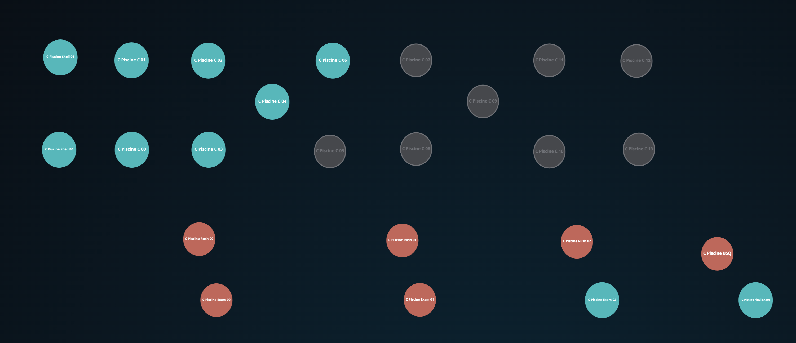

<h1 align="center">
  42-piscine
</h1>

  <b><i>Este repositorio contiene codigicación desarrollada en <a href="https://www.42malaga.com/">42 Málaga</a> C bootcamp (también conocido como 'Piscina')</i></b> 
  Fecha de inicio: 06/03/2023.  Fecha de finalización: 31/03/2023

	
	
	
	
	

<h3 align="center">
  <a href="#%EF%B8%8F-sobre-42">Sobre 42</a>
	 · 
	<a href="#%EF%B8%8F-habilidades-desarrolladas-en-42piscine">Habilidades desarrolladas en 42piscine</a>
	 · 
	<a href="#-42s-galaxy-curriculum">42's galaxy (curriculum)</a> 
</h3>

## 🗣️ Sobre 42

	42 es una iniciativa de educación global que propone una nueva forma de aprender tecnología: sin profesores,
	sin aulas, estudiantes aprendiendo de sus compañeros (peer to peer learning), con una metodología
	que desarrolla habilidades informáticas y para la vida. El cursus 42 es gratuito para quien sea
	aprobado en su proceso de selección. El llamado "C Piscine", una bootcamp de programación en C de
	26 días, es la última etapa del proceso de selección para convertirse en estudiante de 42.

 ## 🛠️ Habilidades desarrolladas en 42piscine
 
 ### Hard-skills
    # C Language
            El idioma principal que se aprende en 42 Piscine es C: manejo de variables,
            punteros, asignación de memoria, macros, así como la creación de funciones y
            programas, incluido el uso y la creación de librerias y Makefiles.

    # Shell
            Los primeros días del bootcamp están dedicados a aprender comandos en shell básicos
            e intermedios para navegar sin problemas a través de la terminal.

    # Git
            Todos los proyectos se envían a través de un repositorio git remoto, lo que exige
            que los estudiantes se sientan cómodos con dicho sistema.

### Soft-skills
    # Autoaprendizaje y proactividad
            En 42, el autoaprendizaje es el núcleo de su metodología de aprendizaje entre pares.
            No hay profesores en absoluto; el proceso de aprendizaje se basa en googlear, preguntar
            a tus compañeros y asistir a clases que los propios alumnos convocan. Así, aunque cada
            alumno aprenda a su propio ritmo, nadie se queda atrás.

    # Trabajo en equipo
            Los fines de semana se propone un proyecto en equipo de 48h llamado "Rush": un grupo de
            3 o 4 miembros elegidos al azar por el sistema de la escuela debe desarrollar en colaboración
            una aplicación completamente operativa. El gran desafío aquí es igualar los diferentes niveles
            de conocimiento y encontrar una metodología de trabajo común que permita a todos los
            miembros del equipo contribuir al proyecto.

    # Gestión del tiempo y resiliencia
            La escuela está abierta 24/7. Así, los llamados "pisciners" son libres de trabajar cuando lo
            deseen, lo que exige una excelente gestión del tiempo y resilencia para no "ahogarse" en medio
            de la enorme carga de trabajo que exige el programa de 26 días sin parar.

## 🌌 42's galaxy (curriculum)

La siguiente tabla presenta el plan de estudios de C Piscine en el orgen cronológico en el que fue completado por mí; el orden de las materias completadas y el nivel alcanzado correspondiente puede variar entre los estudiantes.

|#	|SUBJECT							|LANGUAGE	|DURATION		|EXPERIENCE	|STATUS						|ATTAINED LEVEL	|
|:-:|:--								|:-:		|--:			|--:		|--:						|:--			|
|01	|[Shell 00](./c_piscine_shell_00)	|Shell		|about 1 day	|100 XP		|100% :heavy_check_mark:	|level 0 - 88%	|
|02	|Exam 00							|C			|about 4 hours	|225 XP		|0% :x:		|-				|
|03	|[Rush 00](./c_piscine_rush_00)		|C			|2 days			|150 XP		|0% :x:						|-				|
|04	|[Shell 01](./c_piscine_shell_01)	|Shell		|about 1 day	|100 XP		|100% :heavy_check_mark:	|level 1 - 67%	|
|05	|[C 00](./c_piscine_c_00)			|C			|about 1 day	|100 XP		|85% :heavy_check_mark:	|level 2 - 29%	|
|06	|Exam 01							|C			|about 4 hours	|225 XP		|16% :x:		|-				|
|07	|Rush 01		|C			|2 days			|150 XP		|0% :x:						|-				|
|08	|[C 01](./c_piscine_c_01)			|C			|about 1 day	|100 XP		|100% :heavy_check_mark:	|level 2 - 98%	|
|09	|Exam 02							|C			|about 4 hours	|225 XP		|28% :heavy_check_mark:		|level 3 - 36%	|
|10	|[Rush 02](./c_piscine_rush_02)		|C			|2 days			|150 XP		|0% :x:					|-				|
|11	|[C 03](./c_piscine_c_03)			|C			|about 1 day	|100 XP		|100% :heavy_check_mark:	|level 3 - 96%	|
|12	|[C 02](./c_piscine_c_02)			|C			|about 1 day	|100 XP		|65% :heavy_check_mark:		|level 4 - 31%	|
|13	|[C 04](./c_piscine_c_04)			|C			|about 1 day	|100 XP		|70% :heavy_check_mark:	|level 4 - 68%	|
|14	|[C 06](./c_piscine_c_06)			|C			|about 1 day	|100 XP		|70% :heavy_check_mark:	|level 5 - 05%	|
|15	|BSQ							|C			|about 1 day	|225 XP	|0% :x:		|-				|
|16	|Final Exam							|C			|about 8 hours	|375 XP		|36% :heavy_check_mark:		|level 5 - 68%	|
